# Projet de cadrage en eco-conception numerique

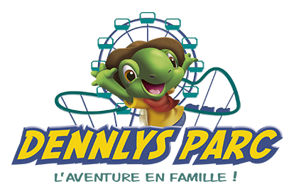

## Contexte

Ce depot rassemble les livrables de cadrage d'un projet d'amelioration du site Dennlys Parc dans une demarche d'eco-conception.

L'objectif est de transformer l'analyse deja realisee en un plan d'action concret, priorise et directement mobilisable pour la suite du projet.

Le travail s'appuie sur :

- une ACV flash et des constats issus du Brief #1
- une cartographie complete des contraintes projet
- un backlog initial exploitable
- une roadmap de mise en oeuvre sur 6 mois.

## Synthese de l'ACV amont

Les elements ci-dessous reprennent la synthese de l'analyse menee en amont dans le cadre du Brief #1. Ils constituent le point de depart du cadrage et orientent la priorisation des actions d'eco-conception.

## Unite fonctionnelle

L'unite fonctionnelle retenue pour ce projet est la suivante :

**Consulter le site afin de preparer une visite au parc et obtenir les informations essentielles en ligne.**

- Nom du service numerique : Dennlys Parc
- Lien du service : [https://www.dennlys-parc.com/](https://www.dennlys-parc.com/)
- Description courte : site web d'un parc d'attractions permettant aux visiteurs de consulter les informations pratiques, de decouvrir les attractions et de preparer leur visite.
- Categorie de service retenue : e-commerce, catalogue ou reservation
- Public cible principal :
  - familles avec enfants
  - groupes scolaires
  - comites d'entreprise et groupes organises
  - visiteurs occasionnels issus du tourisme local ou regional.
- Contexte et frequence d'usage :
  - 124 000 sessions sur la periode analysee
  - 26 000 utilisateurs actifs, dont 24 000 nouveaux
  - duree moyenne d'engagement : 1 min 33 s
  - trafic majoritairement organique avec une part importante de trafic direct
  - usage tres majoritairement mobile, avec une part desktop secondaire.
- Duree de vie estimee : service concu pour etre utilise sur plusieurs annees, avec des evolutions progressives sur 3 a 5 ans sans refonte complete.

## Finalite du depot

Ce depot a ete construit pour rendre visible la coherence entre :

- le service reel analyse
- l'unite fonctionnelle et les mecanismes d'impact identifies
- les priorites d'eco-conception retenues
- les actions techniques realistes a engager
- les livrables attendus pour la presentation orale et l'evaluation.

## Structure du projet

### Livrables de cadrage

- `cartographie/` : cartographie de cadrage, contraintes, objectifs, risques et facteurs de reussite.
- `roadmap/` : feuille de route de mise en oeuvre sur 6 mois.
- `backlog/` : backlog initial au format Markdown.
- `eco-index/` : fichier d'analyse EcoIndex au format Excel.
- `mesures/` : captures d'ecran de mesures complementaires.

## Etat d'avancement

Le depot centralise l'ensemble des principaux supports de cadrage du projet.

- La cartographie de cadrage est disponible.
- La feuille de route 6 mois est disponible.
- Le backlog initial est disponible.
- Le fichier d'analyse EcoIndex est disponible dans le depot.
- Le support de slides est disponible en ligne.
- Le cadrage est realise prioritairement sur le site reel Dennlys Parc.

## Livrables attendus

Le depot rassemble les livrables suivants et precise leur etat d'avancement :

| Livrable | Emplacement | Statut |
| --- | --- | --- |
| Cartographie de cadrage du projet | `cartographie/` | Disponible |
| Support de slides du plan d'action 6 mois | [Gamma - présentation](https://gamma.app/docs/Cadrer-un-service-numerique-pour-une-mise-en-uvre-responsable-zeyb74vmb9rprvf) | Disponible |
| Plan d'action sur 6 mois | `roadmap/` | Disponible |
| Backlog initial | `backlog/backlog.md` | Disponible |
| Fichier d'analyse EcoIndex | `eco-index/EcoIndex jour 4.xlsx` | Disponible |

## Synthese EcoIndex

Le fichier d'analyse EcoIndex est disponible ici : [EcoIndex jour 4.xlsx](/Users/christophe/Web/upskilling%20ECO/eco-index/EcoIndex%20jour%204.xlsx).

L'analyse porte sur 7 pages du site Dennlys Parc. Elle fait apparaitre un niveau de performance environnementale encore heterogene selon les parcours et confirme la necessite de cibler en priorite les pages d'entree et les pages riches en medias.

- Score EcoIndex moyen observe : `58,31`, soit une note moyenne proche de `C`
- Nombre moyen de requetes : `61,29`
- Poids moyen transfere : `9 221,57 Ko`
- Taille moyenne du DOM : `590,14`
- Emissions moyennes estimees : `1,83 gCO2e`
- Consommation moyenne d'eau estimee : `2,75 cl`

Quelques constats saillants ressortent de cette premiere mesure :

- la page `billetterie` est la plus performante de l'echantillon avec un score de `74,69` et une note `B`
- la page `attractions` est la plus critique avec un score de `35,52` et une note `E`
- la page d'accueil presente elle aussi une note `E` avec un poids tres eleve releve dans le fichier, ce qui confirme un axe de travail prioritaire

## Mesures complementaires

En complement du fichier Excel, plusieurs captures ont ete conservees afin de documenter les constats et de croiser les resultats obtenus avec d'autres outils de mesure.

### Meexr

Cette mesure est mise en avant car elle propose une lecture plus transversale de l'audit, en croisant score global, notes par criteres et estimation d'impact en fonction du volume de trafic.

- Score total releve : `45 %`, soit une note `D`
- Notes par criteres visibles sur la capture : `B` en bonnes pratiques, `B` en accessibilite, `C` en performance, `A` en compatibilite, `B` en referencement et `D` en hebergement
- Estimation affichee pour `124 000 visiteurs` : `1085,21 kg` de CO2e, `1627,81 L` d'eau et `2196,78 kWh` d'electricite

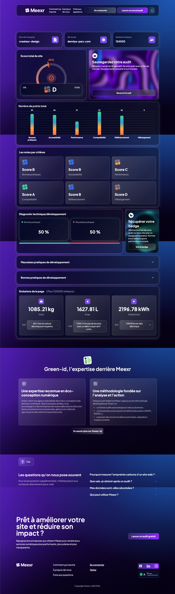

Capture complete : [Meexr](./mesures/screencapture-meexr-fr-audit-69ef4083eca770b3265cf9ce-2026-04-27-13_03_19.png)

### EcoIndex

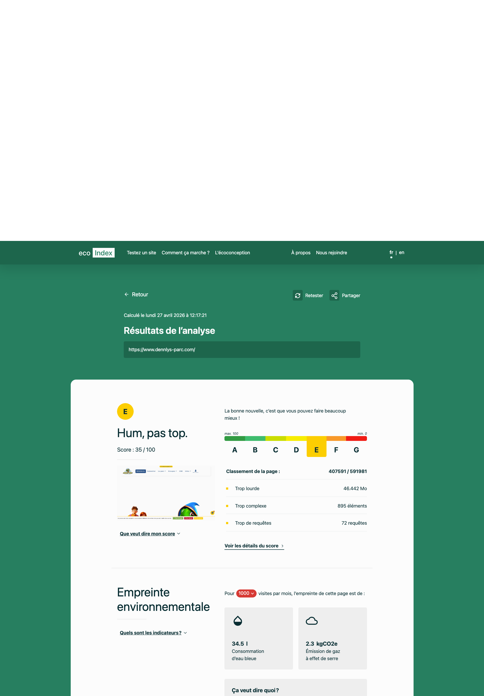

Capture complete : [EcoIndex](./mesures/screencapture-ecoindex-fr-resultat-2026-04-27-12_18_04.png)

### Website Carbon

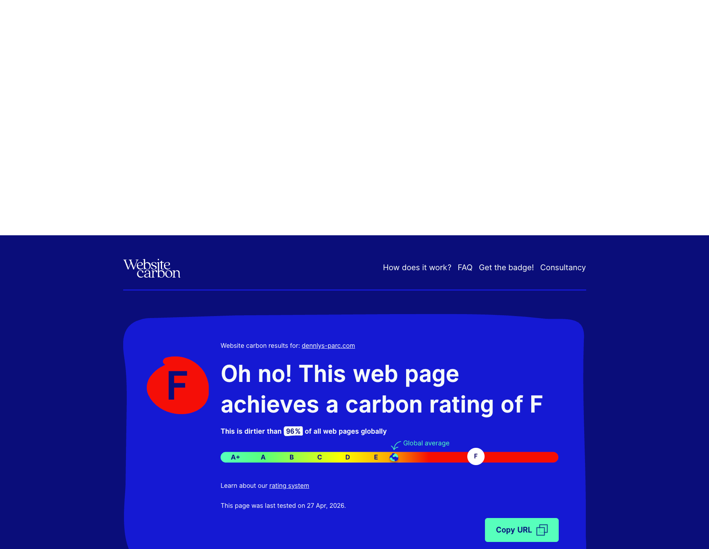

Capture complete : [Website Carbon](./mesures/screencapture-websitecarbon-website-dennlys-parc-com-2026-04-27-12_19_03.png)

### Yellow Lab Tools

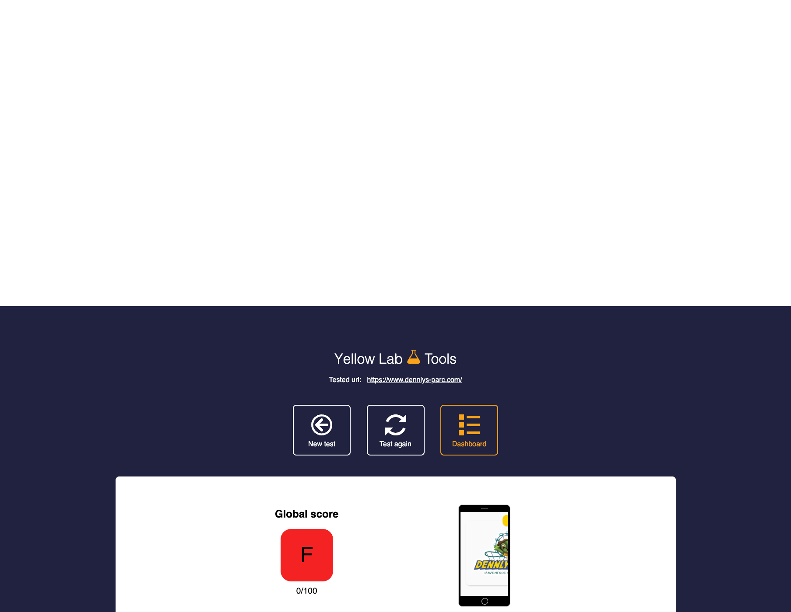

Capture complete : [Yellow Lab Tools](./mesures/screencapture-yellowlab-tools-result-hhztbagpnb-2026-04-27-12_13_40.png)

### BuiltWith

L'outil BuiltWith n'apporte pas de score environnemental a proprement parler, mais il permet d'identifier rapidement plusieurs briques techniques, scripts et services tiers potentiellement impliques dans la charge du site.

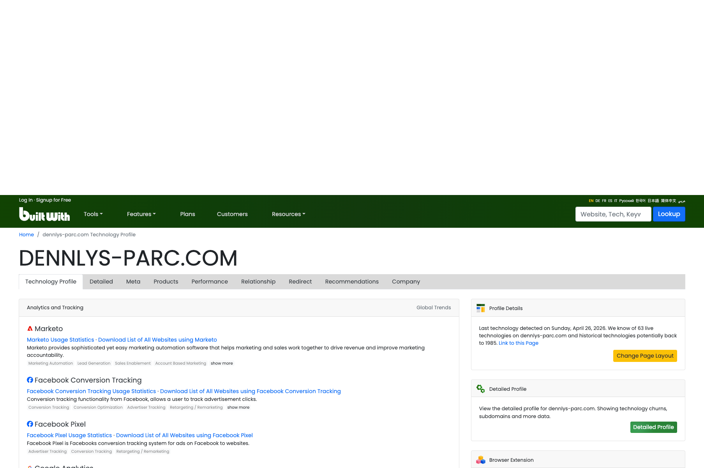

Capture complete : [BuiltWith](./mesures/screencapture-builtwith-dennlys-parc-com-2026-04-27-12_22_29.png)

## Approche eco-conception

La logique de cadrage retenue repose sur quelques principes directeurs :

- prioriser les impacts les plus significatifs avant d'optimiser a la marge
- relier chaque constat d'analyse a une action technique mesurable
- arbitrer entre valeur d'usage, sobriete fonctionnelle et cout de mise en oeuvre
- documenter les KPI qui permettront de suivre les gains dans le temps
- construire une trajectoire realiste, progressive et verifiable sur 6 mois.

L'enjeu n'est pas uniquement de produire un constat, mais bien de disposer d'un cadre de travail utile, actionnable et mesurable pour la suite du projet.

## Visuels de cadrage

### Cartographie

#### Contraintes

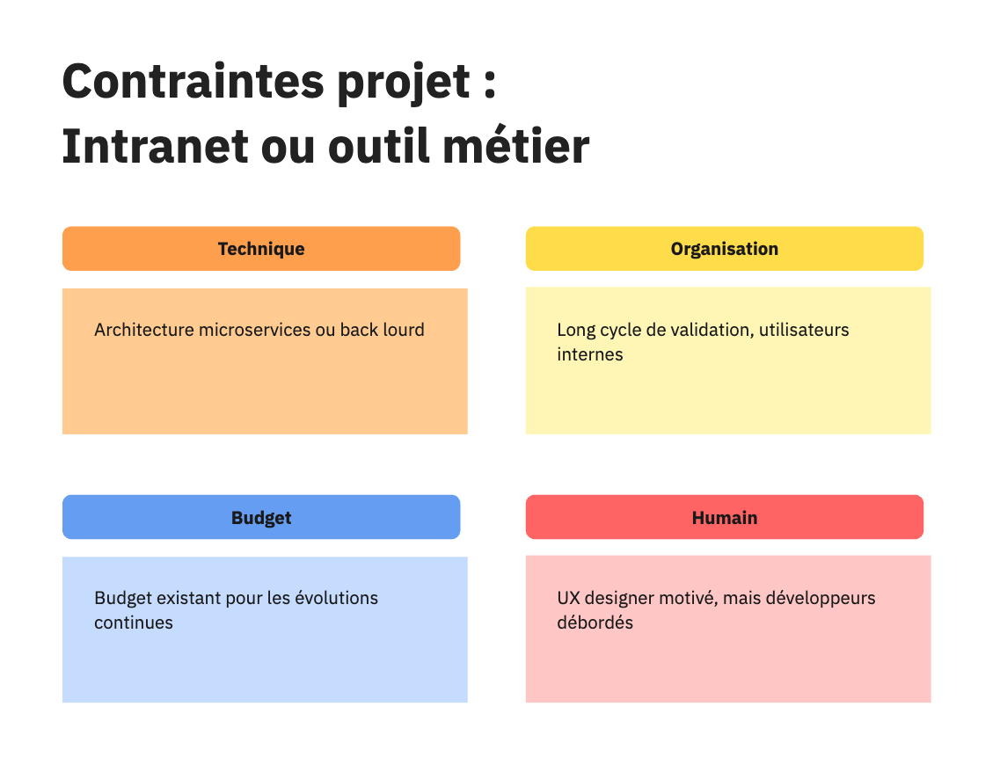

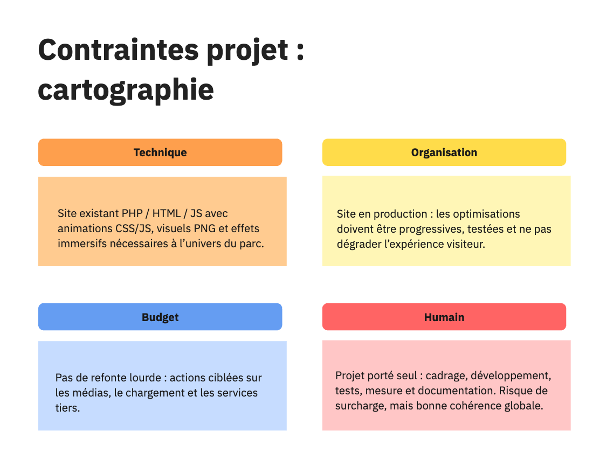

#### Besoins, priorites et objectifs

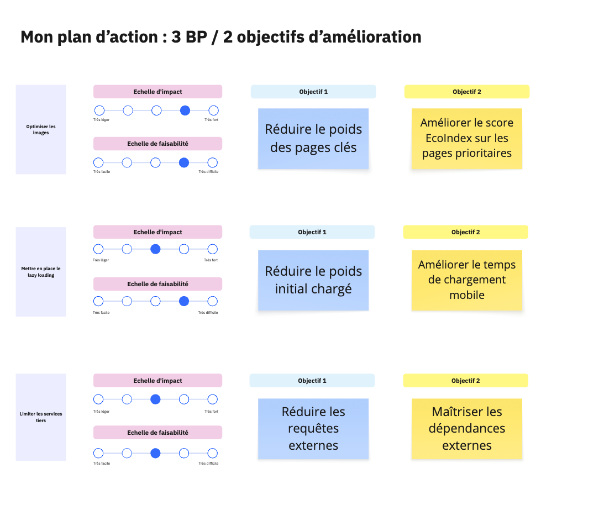

#### Risques et reussite

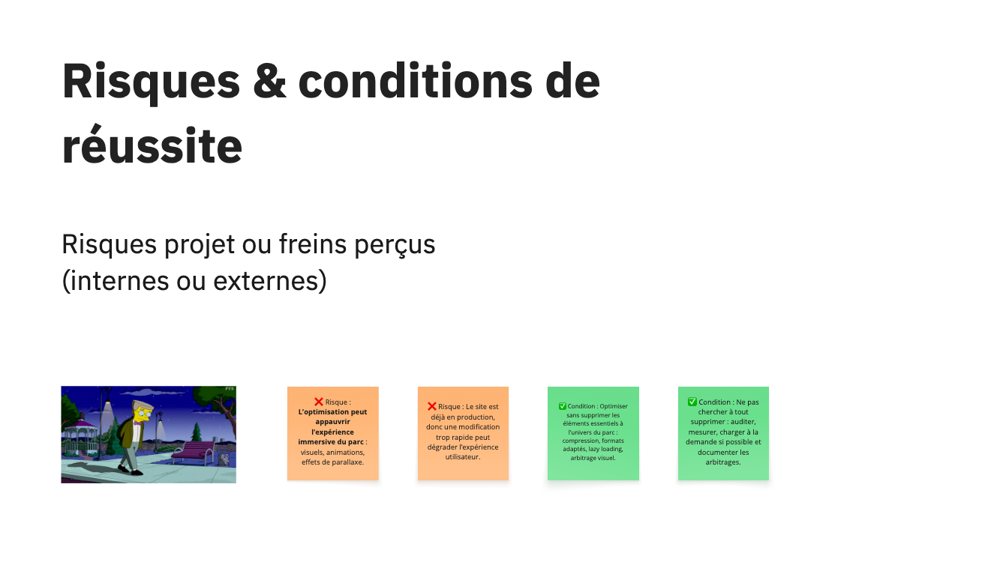

#### Feuille de route

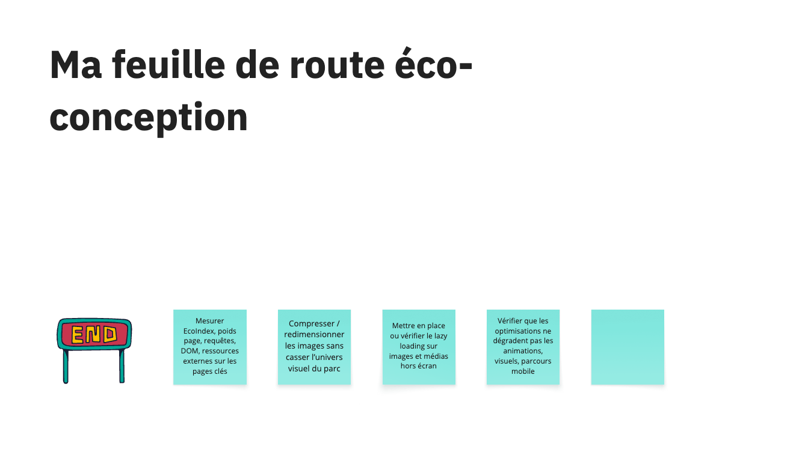

### Roadmap

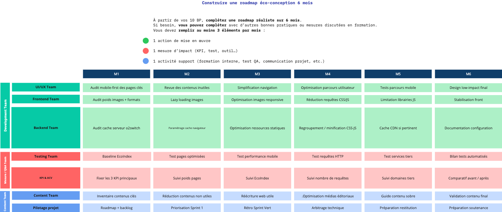

## Conclusion

Ce depot permet aujourd'hui de relier l'analyse ACV amont, l'unite fonctionnelle retenue, les premiers indicateurs environnementaux et les actions priorisees pour Dennlys Parc. Le cadrage du projet est donc en place pour engager une mise en oeuvre responsable, progressive et mesurable sur les 6 prochains mois.
